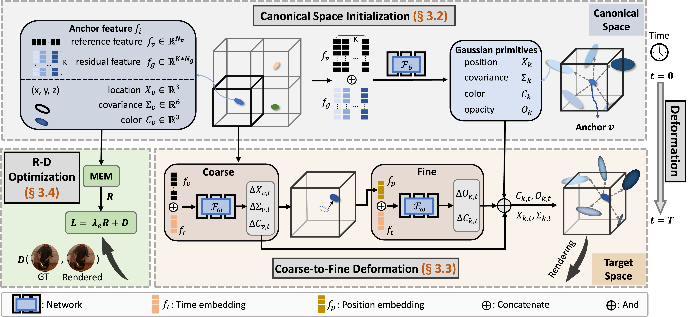
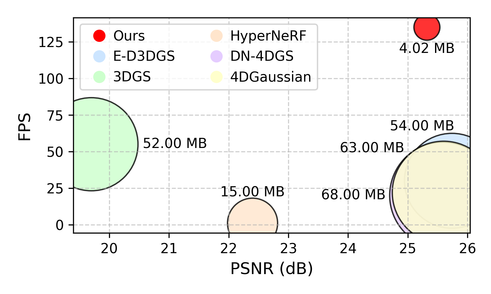

# [IJCAI2025] ADC-GS
Official Pytorch implementation of **ADC-GS: Anchor-Driven Deformable and Compressed Gaussian Splatting for Dynamic Scene Reconstruction**.

<p align="center">
  
</p>

[[`Arxiv`](https://arxiv.org/abs/2505.08196)]  [[`Github`](https://github.com/H-Huang774/ADC-GS)]

## Performance
<p align="center">
  
</p>

## Installation
```
conda create -n adc_gs python=3.8
conda activate adc_gs
pip install torch==1.12.1+cu116 torchvision==0.13.1+cu116 torchaudio==0.12.1 --extra-index-url https://download.pytorch.org/whl/cu116

# Clone this repository
git clone https://github.com/H-Huang774/ADC-GS.git
cd ADC-GS

# Install submodules
pip install submodules/diff-gaussian-rasterization
pip install submodules/simple-knn

# Install other dependencies
pip install -r requirements.txt
```
## Dataset
Please download datasets from their official websites : [HyperNerf](https://github.com/google/hypernerf/releases/tag/v0.1) and [Neural 3D Video](https://github.com/facebookresearch/Neural_3D_Video) <br><br>

**Extracting point clouds from COLMAP:** 
```bash
# setup COLMAP 
bash script/colmap_setup.sh
conda activate colmapenv 

# automatically extract the frames and reorginize them
python script/pre_n3v.py --videopath <dataset>/<scene>
python script/pre_hypernerf.py --videopath <dataset>/<scene>

# downsample dense point clouds
python script/downsample_point.py \
<location>/<scene>/colmap/dense/workspace/fused.ply <location>/<scene>/points3D_downsample.ply
```


After running COLMAP, HyperNerf and Neural 3D Video datasets are orginized as follows:
```
├── data
│   | n3v
│     ├── cook_spinach
│       ├── colmap
│       ├── images
│           ├── cam01
│               ├── 0000.png
│               ├── 0001.png
│               ├── ...
│           ├── cam02
│               ├── 0000.png
│               ├── 0001.png
│               ├── ...
│     ├── cut_roasted_beef
|     ├── ...
```
## Training/Rendering/Metric

bash train_n3v.sh

## Acknowledgements
This code is based on [E-D3DGS](https://github.com/JeongminB/E-D3DGS), [CompGS](https://github.com/LiuXiangrui/CompGS) and [3DGS](https://repo-sam.inria.fr/fungraph/3d-gaussian-splatting/).

## Citation
If you find our code or paper useful, please consider citing:

```bibtex
@article{huang2025adc,
  title={ADC-GS: Anchor-Driven Deformable and Compressed Gaussian Splatting for Dynamic Scene Reconstruction},
  author={Huang, He and Yang, Qi and Liu, Mufan and Xu, Yiling and Li, Zhu},
  journal={arXiv preprint arXiv:2505.08196},
  year={2025}
}
```

